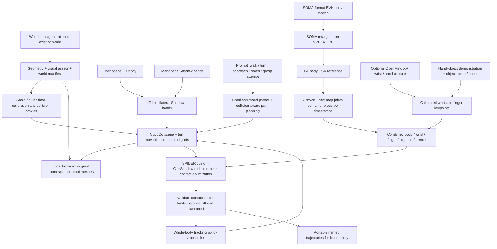

# Integration process and execution boundary

World Labs is the environment source; MuJoCo is the robot physics engine. Body retargeting, dexterous retargeting, and execution control are separate stages with different inputs.

## Role of each repository

| Component | Chosen role | Local status |
|---|---|---|
| [Menagerie G1](https://github.com/google-deepmind/mujoco_menagerie/tree/main/unitree_g1) | Robot body, mass/inertia, joints, contacts | Running; its supplied articulated hands have three fingers, so those were not used |
| [Menagerie Shadow Hand](https://github.com/google-deepmind/mujoco_menagerie/tree/main/shadow_hand) | Five-finger manipulation embodiment | Both palms mounted to existing G1 wrists; 44 finger joints, 36 finger actuators |
| [OpenMind teleoperation](https://github.com/OpenMind/humanoid_teleoperate) | Optional human demonstrations and XR input | Source inspected; its listed end effectors and Isaac simulation mode do not supply a ready-made Shadow/MuJoCo bridge |
| [SOMA retargeter](https://github.com/NVIDIA/soma-retargeter) | Human BVH to G1 body reference | Two provided CSV samples downloaded and verified; fresh retargeting requires supported OS/NVIDIA GPU |
| [SPIDER](https://github.com/facebookresearch/spider) | Hand/object and humanoid physics-aware retargeting | Import adapter and scene export implemented; optimizer and custom composite embodiment remain unvalidated |
| [World Labs](https://docs.worldlabs.ai/api) | Swappable room geometry and splat appearance | Exact requested public room rendered as Gaussian splats; two earlier private drafts also imported |

SOMA's documented target is the 29-DoF G1 body. It does not supply this composite robot's finger actions or an object-manipulation policy. SPIDER can supply the contact-aware stage, but its existing standalone Shadow and G1 support does not automatically cover G1 with these attached hands. OpenMind is an optional capture route, so it is not required just to run the local simulation.

## Required interfaces

**Scene contract:** one versioned robot model; metres; Z-up; MuJoCo `wxyz` quaternions; calibrated world-to-simulation transform; explicit robot spawn; independent objects with geometry, mass, friction, initial pose, and task goal. Generated furniture is not automatically segmented into movable bodies. The present column proxies are an approximation and are not a validated reconstruction.

**Motion contract:** timestamps, named joints, root pose, wrist poses, finger targets, object pose, contact events, and source model revision. SOMA's CSV translation is centimetres, Euler angles and joint values are degrees; the importer converts these. Hand and body captures must describe the same synchronized action. Do not concatenate unrelated demonstrations and call the result a manipulation trajectory.

**SPIDER contract:** register the composite embodiment; update fingertip/palm sites, task weights, actuators, tendon mappings, and object indexing; create the dataset-specific keypoint/contact inputs; generate matching reference arrays; optimize against the actual scene. Existing optimizer array slices and object conventions must be audited for this joint layout. A portable scene and a SOMA CSV alone are insufficient to execute that stage. [Upstream physics workflow](https://github.com/facebookresearch/spider/blob/main/docs/workflows/workflow-mjwp.md)

**Execution contract:** reference trajectories do not guarantee dynamic balance. Adding hands changes inertia and contact behavior, so a stock G1 walking policy requires validation and likely retraining. A production controller must combine balance, locomotion, arm movement, finger action, and object contact. The Mac prototype explicitly reports its base-support constraint. The native viewer can disable it, exposing uncontrolled free-body dynamics; the browser keeps assistance active.

## Next execution milestones

1. Calibrate generated-room dimensions and floor height, check walkable paths, and replace coarse collision proxies near task contacts. The requested public room already renders its 150k splats in the browser. It has no collider mesh, so its 528 occupancy columns need geometric validation.
2. Record or obtain one synchronized human hand/body/object demonstration for the household bottle task. Capture finger keypoints and the object trajectory; body-only pickup CSVs are insufficient.
3. Run fresh SOMA retargeting on a supported NVIDIA machine; retain the resulting body motion as a reference. The documented tool requires Python 3.12, supported Windows/Linux, and an NVIDIA GPU.
4. Implement and run the composite SPIDER embodiment on an NVIDIA MuJoCo Warp worker; use its result to initialize a tracking controller. Keep the GPU runtime isolated from the Mac environment.
5. Require a bottle lift of at least 10 cm, sustained hand contact, placement within a 5 cm target region, and stability after release. Repeat with varied object pose, friction, mass, and room geometry. Separately validate locomotion without base support and without body penetration or foot sliding.

The browser and native workbenches, bounded prompt commands, path planner, labeled objects, XYZ axes, conversion code, source revisions, and portable scene are implemented. Successful free-standing walking, reliable bottle pick-and-place, fresh SOMA retargeting, and SPIDER optimization must not be inferred from assisted playback.
